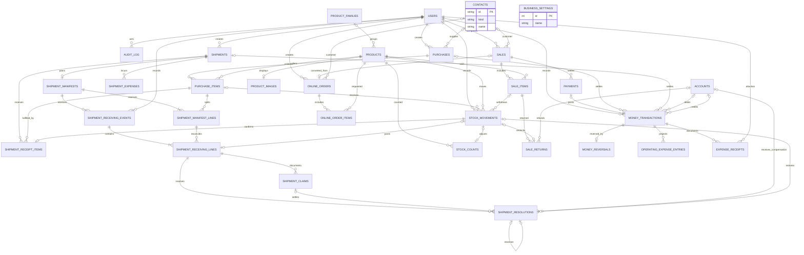

# Entity relationships

The diagram describes the live SQLite schema. [Spring V6 sales and account relationships](SPRING_SALES.md)

```mermaid
erDiagram
  USERS ||--o{ AUDIT_LOG : acts
  USERS ||--o{ STOCK_MOVEMENTS : records
  USERS ||--o{ MONEY_TRANSACTIONS : records
  USERS ||--o{ SALES : completes
  USERS ||--o{ PURCHASES : creates
  USERS ||--o{ SHIPMENTS : creates
  USERS ||--o{ ONLINE_ORDERS : creates
  PURCHASES ||--o{ PURCHASE_ITEMS : orders
  PRODUCTS ||--o{ PURCHASE_ITEMS : ordered
  SHIPMENTS ||--o{ SHIPMENT_EXPENSES : incurs
  SHIPMENTS ||--o{ SHIPMENT_RECEIPT_ITEMS : receives
  SHIPMENTS ||--o| SHIPMENT_MANIFESTS : plans
  SHIPMENT_MANIFESTS ||--|{ SHIPMENT_MANIFEST_LINES : reserves
  PURCHASE_ITEMS ||--o{ SHIPMENT_MANIFEST_LINES : splits
  SHIPMENT_MANIFESTS ||--o{ SHIPMENT_RECEIVING_EVENTS : receives
  USERS ||--o{ SHIPMENT_RECEIVING_EVENTS : records
  SHIPMENT_RECEIVING_EVENTS ||--|{ SHIPMENT_RECEIVING_LINES : contains
  SHIPMENT_RECEIVING_LINES ||--o{ SHIPMENT_CLAIMS : documents
  SHIPMENT_RECEIVING_LINES ||--o{ SHIPMENT_RESOLUTIONS : resolves
  SHIPMENT_CLAIMS o|--o{ SHIPMENT_RESOLUTIONS : settles
  ACCOUNTS o|--o{ SHIPMENT_RESOLUTIONS : receives_compensation
  STOCK_MOVEMENTS o|--o| SHIPMENT_RESOLUTIONS : restores
  SHIPMENT_RESOLUTIONS o|--o| SHIPMENT_RESOLUTIONS : reverses
  SHIPMENT_MANIFEST_LINES ||--o{ SHIPMENT_RECEIVING_LINES : reconciles
  STOCK_MOVEMENTS o|--o| SHIPMENT_RECEIVING_LINES : posts
  PURCHASE_ITEMS ||--o{ SHIPMENT_RECEIPT_ITEMS : fulfilled_by
  STOCK_MOVEMENTS ||--o| SHIPMENT_RECEIPT_ITEMS : confirms
  PURCHASE_ITEMS o|--o{ STOCK_MOVEMENTS : receives
  PRODUCTS ||--o{ STOCK_MOVEMENTS : moves
  PRODUCTS ||--o| PRODUCT_IMAGES : displays
  PRODUCT_FAMILIES o|--o{ PRODUCTS : groups
  PRODUCTS ||--o{ STOCK_COUNTS : counted
  STOCK_MOVEMENTS o|--o| STOCK_COUNTS : adjusts
  SALES ||--o{ SALE_ITEMS : includes
  PRODUCTS ||--o{ SALE_ITEMS : sold
  SALE_ITEMS ||--o{ SALE_RETURNS : returned
  STOCK_MOVEMENTS o|--o| SALE_RETURNS : restocks
  ACCOUNTS o|--o{ SALE_RETURNS : refunds
  SALE_ITEMS o|--o{ STOCK_MOVEMENTS : withdraws
  SALES ||--o{ PAYMENTS : settles
  PAYMENTS o|--|| MONEY_TRANSACTIONS : posts
  PURCHASES o|--o{ MONEY_TRANSACTIONS : settles
  SHIPMENTS o|--o{ MONEY_TRANSACTIONS : settles
  MONEY_TRANSACTIONS ||--o| MONEY_REVERSALS : reversed_by
  ACCOUNTS o|--o{ MONEY_TRANSACTIONS : debits
  ACCOUNTS o|--o{ MONEY_TRANSACTIONS : credits
  MONEY_TRANSACTIONS ||--o{ OPERATING_EXPENSE_ENTRIES : projects
  MONEY_TRANSACTIONS ||--o{ EXPENSE_RECEIPTS : documents
  USERS ||--o{ EXPENSE_RECEIPTS : attaches
  ONLINE_ORDERS ||--o{ ONLINE_ORDER_ITEMS : includes
  PRODUCTS ||--o{ ONLINE_ORDER_ITEMS : requested
  SALES o|--o| ONLINE_ORDERS : converted_from
  CONTACTS o|--o{ SALES : customer
  CONTACTS o|--o{ ONLINE_ORDERS : customer
  CONTACTS o|--o{ PURCHASES : supplier
  CONTACTS {
    string id PK
    string kind
    string name
  }
  BUSINESS_SETTINGS {
    int id PK
    string name
  }
```
